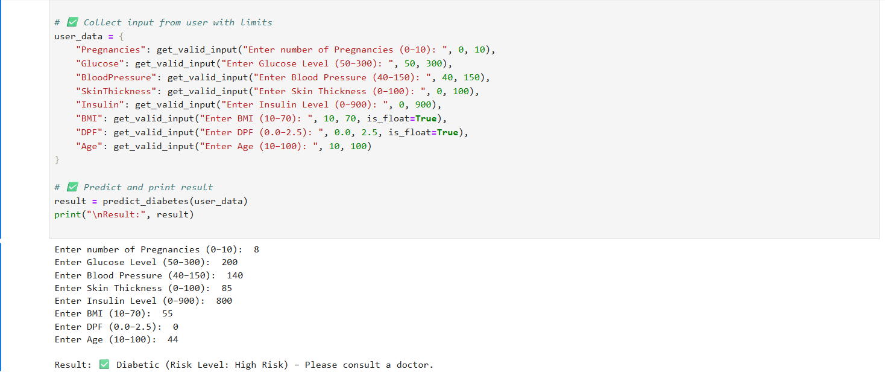
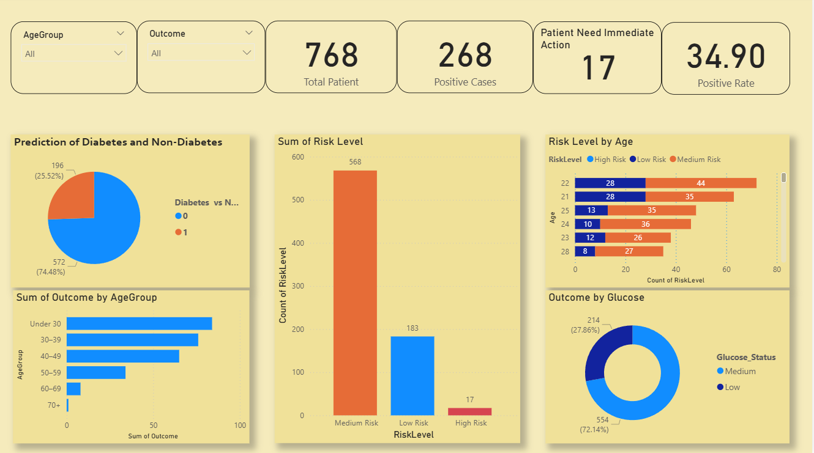

# Data Analytics Project – Diabetes Prediction using Machine Learning & Power BI

This project aims to **predict the likelihood of diabetes** in patients using data analytics, machine learning, and Power BI visualizations. It provides end-to-end insights, from data cleaning and model training to dashboard creation.


# Project Overview

- **Project Title**: Diabetes Prediction using Data Analytics  
- **Dataset**: PIMA Indians Diabetes Dataset  
- **Tech Stack**: Python, Jupyter Notebook, Power BI  
- **Model Used**: Logistic Regression,Random Forest, XG Boost
- **Libraries**: pandas, seaborn, matplotlib, scikit-learn  


# Tools Used 

- Python (Pandas, Scikit-learn, Matplotlib)
- Jupyter Notebook
- Power BI
- GitHub
  


##  Files in This Repository

| File                         | Description                                             |
|-----------------------------|---------------------------------------------------------|
| `diabetes.csv`              | Dataset used for prediction                            |
| `diabetes_Prediction.ipynb` | Jupyter Notebook with data cleaning, EDA & ML model    |
| `Diabetes_prediction.pbix`  | Power BI report showcasing interactive insights        |
| `output_screenshot.png`     | Screenshot of Prediction Output                    |


# Key Features

-  Data Cleaning & Preprocessing using pandas  
-  Exploratory Data Analysis (EDA) with matplotlib/seaborn  
-  Logistic Regression Model (Accuracy: ~78%)  
-  Confusion Matrix & Evaluation Metrics  
-  Fully Interactive Power BI Dashboard  


# Output (New Patient Prediction) 

A patient's medical data was given to the trained ML model.
The model processed and predicted the outcome.
Prediction Result: "Positive for Diabetes" or "Negative for Diabetes"

Below is the screenshot of the model's actual prediction:



# Power BI Dashboard Highlights

The Power BI dashboard visualizes:

- Diabetic vs Non-Diabetic Patients  
- Age Group-wise Diabetes Cases  
- Glucose & BMI Distributions  
- Gender-based Trends (if applicable)  




# Requirements

Install required libraries:

```bash
pip install pandas matplotlib seaborn scikit-learn

##  Contact

For questions or collaborations, feel free to connect:

**Name**: Sakthi Kumar B 

**Email**: b.sakthikumar10@gmail.com
 
**LinkedIn**: [linkedin.com/in/sakthikumar1](https://www.linkedin.com/in/sakthikumar1)  

**GitHub**: [github.com/sakthikumar-1](https://github.com/sakthikumar-1)


